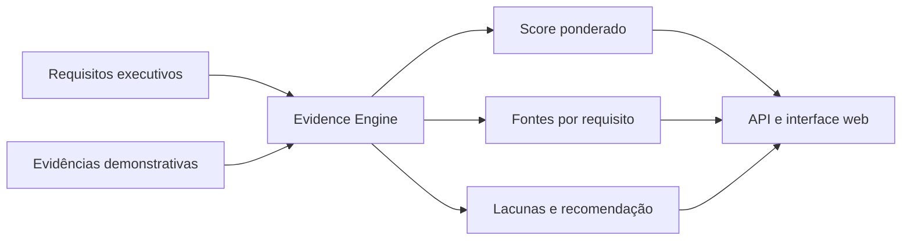
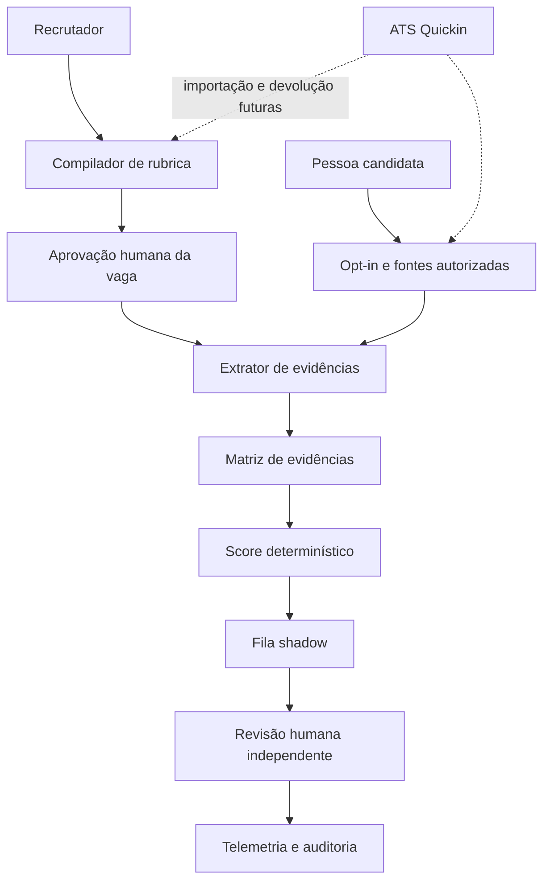

# Arquitetura do Seekerh Signal

## Objetivo

Reduzir o esforço de triagem sem transformar IA em árbitro de contratação. O sistema organiza evidências fornecidas voluntariamente, mede aderência contra uma rubrica aprovada e entrega uma explicação revisável ao recrutador.

## Princípios

1. Evidência antes de inferência.
2. Resultado de negócio antes de escolha de modelo.
3. Humano responsável por toda decisão de contratação.
4. Shadow antes de influência operacional.
5. Ausência de presença pública é neutra.
6. Toda afirmação tem fonte, data, confiança e versão do avaliador.
7. Dados protegidos ficam fora do caminho de pontuação.

## Estado atual

O MVP executável prova o núcleo determinístico com um cenário estático:



| Componente | Responsabilidade |
|---|---|
| `src/domain/demo-scenario.ts` | Rubrica e evidências demonstrativas |
| `src/domain/evidence-engine.ts` | Correspondência, score, cobertura, recomendação e lacunas |
| `src/domain/types.ts` | Contratos imutáveis do domínio |
| `src/server.ts` | HTTP, arquivos estáticos, `/api/demo` e `/health` |
| `public/` | Apresentação da prova de trabalho |
| `Dockerfile` | Build reprodutível e runtime Node.js 22 sem privilégios |
| `railway.json` | Builder, health check e política de reinício |

Não há LLM, banco, ATS, scraping ou persistência nesta versão. Isso mantém a demonstração executável, explicável e sem coleta real de dados pessoais.

## Regra atual de avaliação

Para cada requisito, o motor normaliza texto e mede a cobertura dos sinais na evidência. O score da evidência é:

```text
score = cobertura_dos_sinais * força_da_prova * 100
```

Forças configuradas:

- Produto ao vivo: `1,00`.
- Repositório: `0,90`.
- Entrega documentada: `0,72`.

O melhor score fundamenta o requisito. O resultado geral é a média ponderada pelos pesos da rubrica. Status atual: `strong >= 70`, `partial >= 35`, `missing < 35`.

Esses valores são parâmetros de demonstração, não ciência de seleção validada. O piloto deve calibrá-los contra avaliações independentes e análises de equidade. A comparação é de uma pessoa com os requisitos da vaga, nunca entre pessoas candidatas.

## Arquitetura-alvo do piloto



### 1. Compilador de rubrica

Recebe descrição da vaga e propõe resultados observáveis, `must-have`, `nice-to-have`, pesos e critérios de aceitação. Uma LLM pode estruturar a proposta, mas a rubrica só entra em vigor após aprovação explícita do recrutador.

### 2. Coleta autorizada

Recebe currículo e URLs fornecidas ou autorizadas pela pessoa candidata. O coletor respeita a finalidade declarada, registra consentimento quando essa for a hipótese aplicável, limita fontes e não faz descoberta aberta de perfis.

### 3. Extrator fundamentado

Extrai afirmações em saída estruturada. Cada item deve conter:

```json
{
  "skill": "governança de IA",
  "claim": "Implementou gates de avaliação antes da promoção",
  "sourceUrl": "https://example.com/projeto",
  "capturedAt": "2026-09-04T12:00:00Z",
  "confidence": 0.91,
  "gap": null
}
```

Afirmação sem fonte válida é descartada. A LLM não atribui score final e não completa lacunas por plausibilidade.

### 4. Score determinístico

Calcula aderência apenas a partir da rubrica aprovada e das afirmações fundamentadas. Versão da rubrica, regra, pesos e limiares acompanham cada resultado para permitir reprodução.

### 5. Revisão humana

Exibe evidências, lacunas, confiança e conflitos. O recrutador pode concordar, corrigir ou rejeitar cada item, sempre com motivo. Durante shadow, a saída não altera a fila real nem a comunicação com candidatos.

## Contratos mínimos do piloto

| Entidade | Campos essenciais |
|---|---|
| `RoleRubric` | vaga, versão, requisito, classe, peso, sinais, aprovador, data |
| `CandidateConsent` | finalidade, fontes autorizadas, versão do aviso, data, revogação |
| `EvidenceClaim` | skill, afirmação, URL, data de captura, confiança, hash do trecho, lacuna |
| `Evaluation` | versão do motor, scores, recomendação shadow, justificativas |
| `HumanReview` | avaliador, decisão, divergências, motivo, data |
| `AuditEvent` | ator, ação, entidade, versão, timestamp, correlation ID |

URLs públicas continuam sendo dados pessoais quando vinculadas a uma pessoa. Nenhum conteúdo bruto deve aparecer em logs de aplicação.

## Privacidade, segurança e equidade

### Antes do piloto

- Elaborar RIPD com fluxo de coleta até descarte, agentes de tratamento, hipótese legal e riscos.
- Formalizar instruções entre controlador e operador, inclusive suboperadores de modelo e hospedagem.
- Definir prazo curto de retenção e processo verificável de exclusão.
- Criar canal para acesso, correção, explicação, oposição e revisão.
- Validar termos das fontes e impedir scraping não autorizado.

### Durante a avaliação

- Substituir identidade por ID opaco antes da extração e pontuação.
- Remover nome, foto e localização do payload de análise.
- Não coletar nem inferir dados sensíveis ou atributos protegidos.
- Criptografar trânsito e armazenamento, com acesso por menor privilégio.
- Separar evidência original, resultado automatizado e decisão humana.
- Não usar dados de candidatos para treinar modelos.
- Oferecer work sample equivalente quando não houver portfólio público.

Localização só pode ser tratada fora da pontuação de capacidade, após justificativa objetiva da vaga e aprovação humana.

## Piloto shadow

### Desenho

- Duração: 4 a 6 semanas.
- Amostra: 3 vagas.
- Volume: 30 a 50 candidaturas por vaga.
- Comparação: triagem manual registrada antes da revelação do Signal.
- Decisão: nenhum efeito automatizado sobre candidatura.

### Métricas

| Métrica | Definição | Meta |
|---|---|---|
| Tempo de triagem | Mediana por candidatura contra linha de base | Redução maior ou igual a 30% |
| Grounding | Afirmações exibidas com URL válida | 100% |
| `quality@5` | Perfis qualificados entre os cinco priorizados | Não inferior à linha de base |
| Concordância | Kappa de Cohen entre recomendação binária e rótulo humano independente | Maior ou igual a 0,60 |
| Revisabilidade | Avaliações com decisão e motivo registrados | 100% |

As métricas devem ser segmentadas por vaga e rota de evidência, portfólio ou work sample. Qualquer sinal de disparidade relevante interrompe a influência operacional até análise e correção.

### Gates

1. Semana 0: aprovar RIPD, rubricas, amostra, linha de base e plano de incidente.
2. Semanas 1 e 2: executar shadow sem revelar scores ao recrutador operacional.
3. Semanas 3 e 4: medir tempo, grounding, qualidade, concordância e divergências.
4. Semanas 5 e 6, se necessárias: recalibrar regras e repetir a amostra afetada.
5. Go ou no-go: avançar apenas com todas as metas e revisão de privacidade aprovadas.

## Operação e observabilidade

O serviço é stateless. Railway injeta `PORT`, e o processo escuta em `0.0.0.0`. O endpoint `/health` responde prontidão sem acessar dados pessoais.

Eventos de produção devem ser JSON estruturado e conter, no mínimo:

- `event`.
- `correlationId`.
- `rubricVersion`.
- `engineVersion`.
- `latencyMs`.
- `outcome`.
- `reviewStatus`.

Nunca registrar currículo, nome, e-mail, URL pessoal completa, trecho de fonte ou prompt com dados pessoais. Métricas agregadas devem usar limites mínimos de grupo para evitar reidentificação.

## Implantação

```text
Railway Router -> container Node.js 22 -> server HTTP stateless
                                  |-> /health
                                  |-> /api/demo
                                  |-> public/
```

O Dockerfile usa build multi-stage. O runtime instala apenas dependências de produção, copia somente o JavaScript de `src` compilado e roda como usuário `node`. O `railway.json` usa `DOCKERFILE`, health check em `/health`, timeout de 300 segundos e até cinco reinícios em falha.

## Falhas seguras

| Falha | Comportamento esperado |
|---|---|
| Fonte indisponível | Marcar lacuna, nunca reconstruir a afirmação |
| Confiança abaixo do limiar | Encaminhar para revisão sem score positivo |
| Rubrica sem aprovação | Bloquear avaliação |
| Consentimento revogado | Interromper coleta e iniciar exclusão conforme política |
| Modelo ou parser indisponível | Preservar processo manual, sem rebaixar candidatura |
| Divergência humana | Registrar motivo e excluir o caso da automação até revisão |

## Não objetivos

- Substituir entrevista ou julgamento profissional.
- Fazer ranking geral de pessoas.
- Inferir fit cultural, personalidade ou potencial por proxies.
- Buscar presença digital sem autorização.
- Rejeitar automaticamente.
- Integrar à Quickin antes do gate shadow.

## Referências

- [LGPD, Lei nº 13.709/2018](https://www.planalto.gov.br/ccivil_03/_ato2015-2018/2018/lei/l13709compilado.htm)
- [ANPD, Relatório de Impacto à Proteção de Dados Pessoais](https://www.gov.br/anpd/pt-br/canais_atendimento/agente-de-tratamento/relatorio-de-impacto-a-protecao-de-dados-pessoais-ripd)
- [ANPD, direitos dos titulares](https://www.gov.br/anpd/pt-br/assuntos/titular-de-dados-1/direito-dos-titulares)
- [Railway, Config as Code](https://docs.railway.com/guides/config-as-code)
- [Railway, deploy com Dockerfiles](https://docs.railway.com/deployments/dockerfiles)
